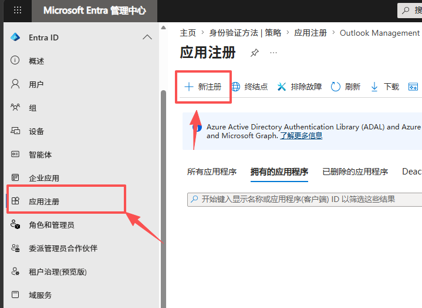

# Outlook Management

Local Outlook mailbox manager MVP.

## Stack

- Frontend: Vue 3 + Vite
- Backend: Python FastAPI
- Database: SQLite
- Mail provider: Microsoft Graph OAuth

## Backend

```powershell
cd backend
python -m uvicorn app.main:app --reload --port 8000
```

Copy `.env.example` to `.env` and fill Microsoft OAuth values before using Graph login.

## Microsoft OAuth Setup

Create a Microsoft application before using Graph login:

1. Open [Microsoft Entra admin center](https://entra.microsoft.com/).
2. Go to `Entra ID` -> `应用注册`.
3. Click `新注册`.



Use these values when registering the app:

```text
Name: Outlook Management Local
Supported account types: Personal Microsoft accounts only
Redirect URI platform: Web
Redirect URI: http://localhost:8000/api/oauth/microsoft/callback
```

After the app is created:

1. Copy `Application (client) ID` into `MS_CLIENT_ID`.
2. Open `Certificates & secrets`, create a new client secret, and copy the secret `Value` into `MS_CLIENT_SECRET`.
3. Keep the other local values unchanged unless you change ports.

```env
MS_CLIENT_ID=your-application-client-id
MS_CLIENT_SECRET=your-client-secret-value
MS_REDIRECT_URI=http://localhost:8000/api/oauth/microsoft/callback
APP_BASE_URL=http://localhost:5173
DATABASE_PATH=./data/outlook_manager.sqlite3
```

## Frontend

```powershell
cd frontend
npm.cmd install
npm.cmd run dev
```

Open the Vite URL shown in the terminal.

Manual Playwright OAuth opens a local Chromium window for you to complete Microsoft login yourself. Install the browser once if needed:

```powershell
cd frontend
npx.cmd playwright install chromium
```

Run frontend end-to-end tests:

```powershell
cd frontend
npm.cmd run test:e2e
```

## Import Format

Accounts:

```text
email@example.com----password----totp-secret
email2@example.com----password----totp-secret
```

Proxies:

```text
195.40.123.187:6371:lxdtjafb:u3mzslwqc1jj
50.114.3.153:6117:lxdtjafb:u3mzslwqc1jj
```

Manual Playwright OAuth randomly uses one active imported proxy when the proxy pool is not empty.
Before launching Playwright, the backend validates active HTTP proxies with a `CONNECT login.microsoftonline.com:443` check. Failed proxies are marked `invalid` and skipped.

Passwords and TOTP secrets are stored as plain text in SQLite for this MVP, per current project decision.
